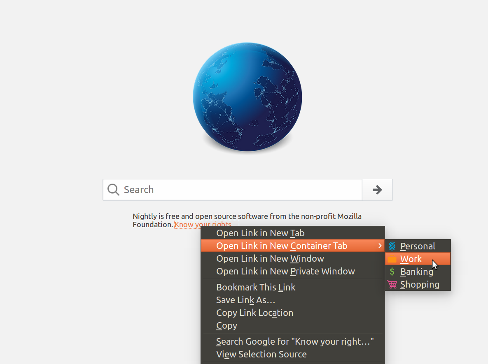
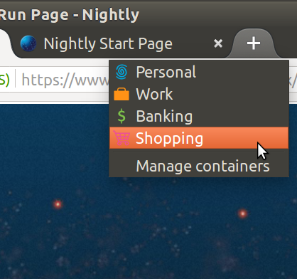
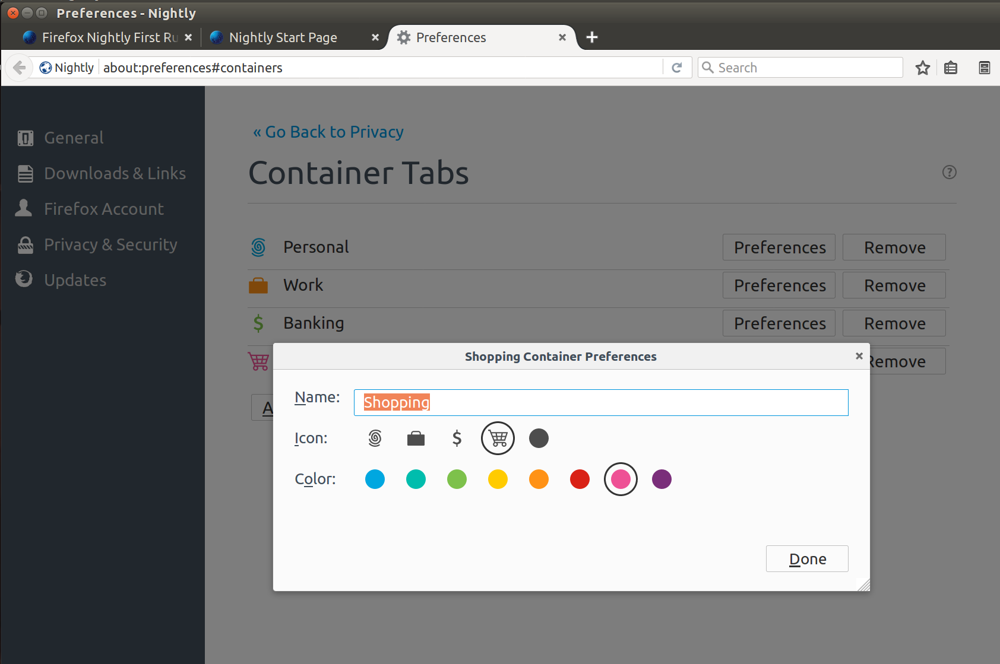
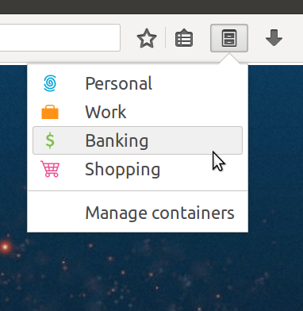

# Background for Containers Workshop *by* [@KingstonTime](https://twitter.com/KingstonTime)

[< Back to the workshop](README.md)

Containers are a feature that we added to Firefox behind a preference to allow users to separate browsing.

> "lightweight persistent contexts that isolate sites from one another"

Containers give you the ability for a Work Gmail and Personal Gmail tab.

## Existing Nightly

Already in [Nightly](https://www.mozilla.org/en-US/firefox/nightly/all/) we had the following behaviour:

## Test Pilot

We recently launched containers to a wider audience called [Test pilot](https://testpilot.firefox.com/) which is Firefox's new way to increase experiments of new features.
It gives the containers team more ability to capture telemetry and feedback on how people are isolating their browser usage.

We used the soon to be deprecated [SDK](glossary.md#sdk) features of addons to leverage features extensions don't have yet as the timelines were tight. However along the way we are simplifying this and also looking to ship this into the platform.

Using Test Pilot give us more exposure and also the ability to clean up the interface and add more features:

- [Test Pilot experiment code](https://github.com/mozilla/testpilot-containers)
- [Adding other features](https://jotter.jonathankingston.co.uk/blog/2017/04/04/containers-assignment/)

# Web extensions

[Web extensions](https://developer.mozilla.org/en-US/Add-ons/WebExtensions/What_are_WebExtensions) are a cross browser solution to what Chrome is shipping, it narrows down the open APIs that SDK have by making the browser more reliable and cross process safe.

Firefox currently will run most of the same APIs that Chrome supports and are working on adding cleaner interfaces to these extensions. Eg using promises for blocking [webRequest](https://developer.mozilla.org/en-US/Add-ons/WebExtensions/API/webRequest) features.

For cross browser feature support view individual MDN API pages EG: [tab.Tab compatibility table](https://developer.mozilla.org/en-US/Add-ons/WebExtensions/API/tabs/Tab#Browser_compatibility)

[< Back to the workshop](README.md)
