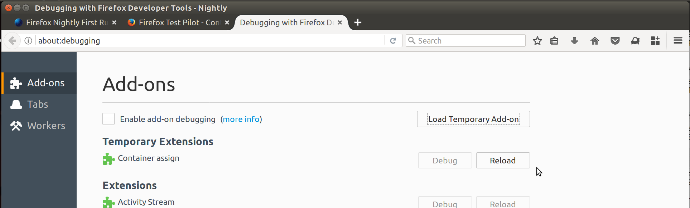
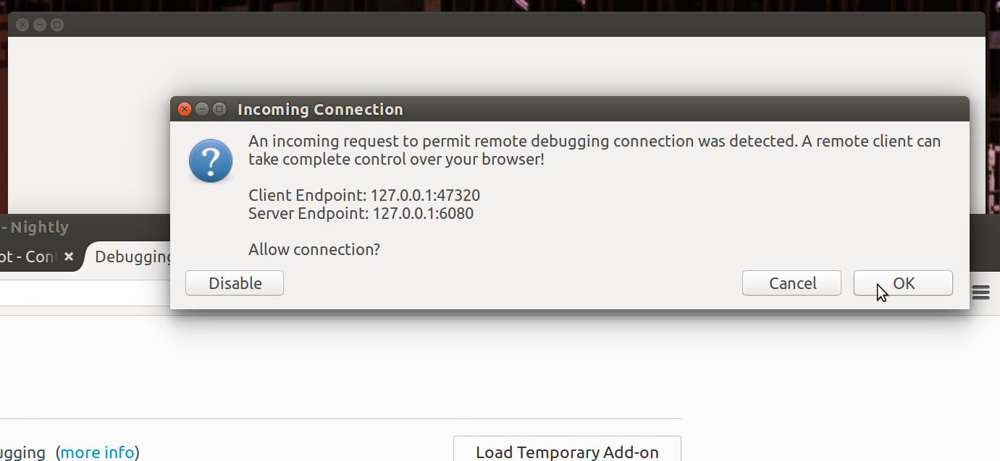
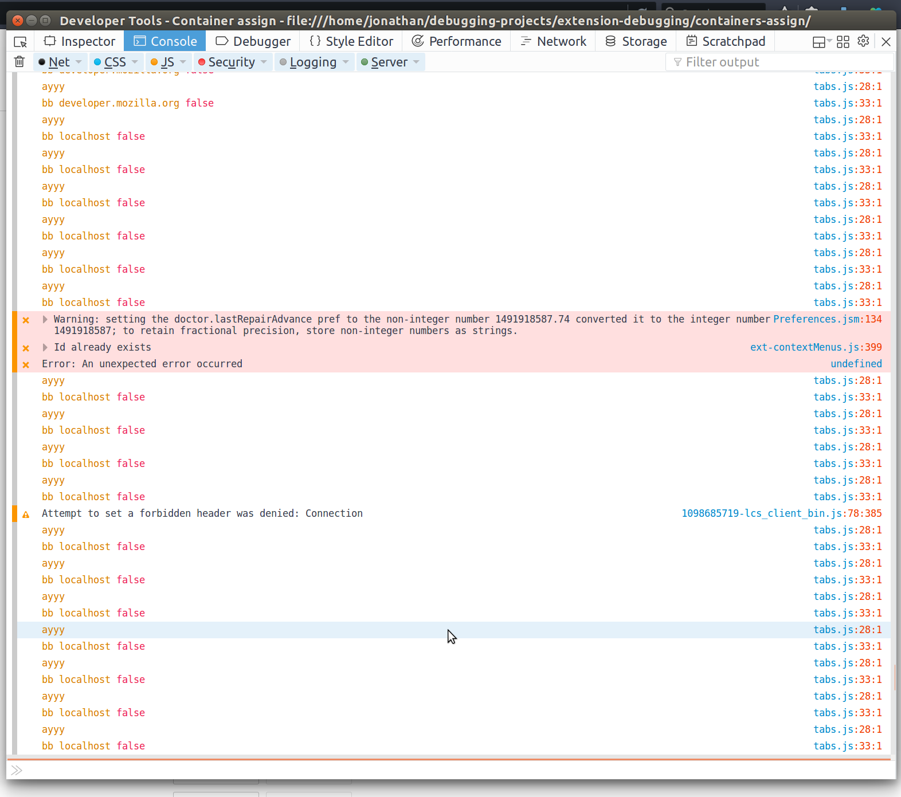
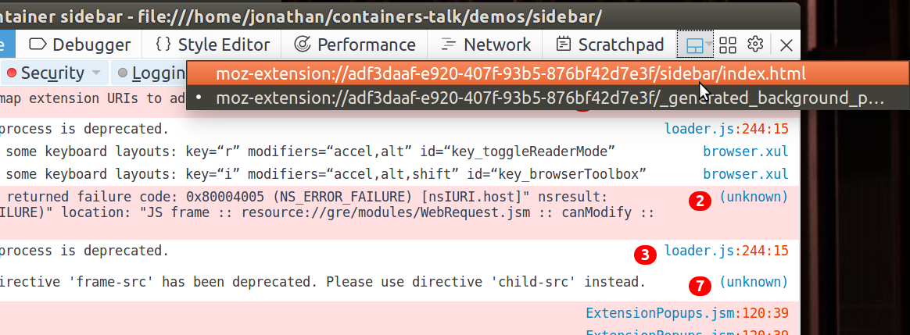
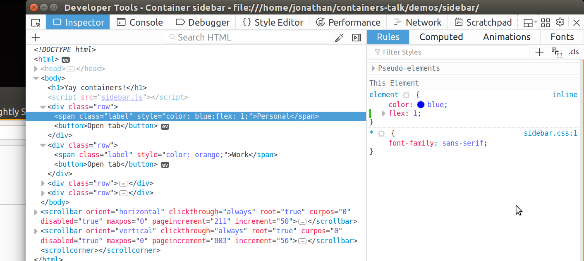
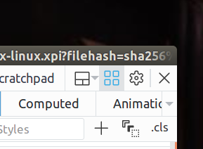

# Debugging - Containers Workshop *by* [@KingstonTime](https://twitter.com/KingstonTime)

[< Back to the workshop](README.md)

## Loading the extension

- Visit "about:debugging"
- Click "Load Temporary Add-on"
- Browse to the directory and select your manifest.json file

## Debugging

To debug your extension:

- Load "about:debugging"
- Check the box "Enable add-on debugging"
- Click debug next to your loaded extension
- Click accept on the incoming connection prompt

Once loaded you should see:

**Hot tip** cmd/ctrl + r in the debugger window will reload the extension with the latest code.

By default the debugger runs in the background page of your extension, if you don't have a background page and just a page you will be getting a "generated background page" with your background scripts included.

To change the debugger to focus on browser actions or sidebar pages, use the following:

You can then modify the pages like a normal web page using the inspector:

To keep popups actions open always click on the following icon:

*This is useful when debugging browser actions or context menus, click **esc** to close the popups*

[< Back to the workshop](README.md)
