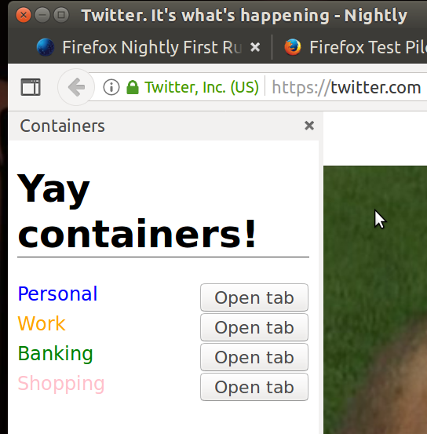

# Container sidebar

## What it does

Lists containers in a sidebar

**This is likely to be buggy**

## What you need

[Setup](../setup.md)

Load the extension in about:debugging as described in [debugging](../debugging.md)

## What it shows

Demonstration of various tab and container APIs for web extensions and sidebars.

[< Back to the workshop](../README.md)
